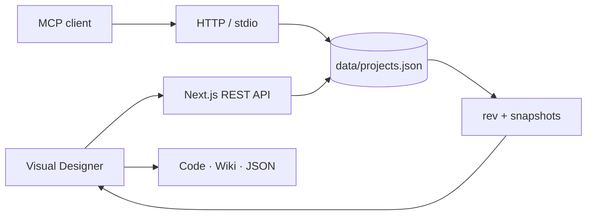

<h1 align="center">MongoModel</h1>

<p align="center">
  <strong>Visual MongoDB Data Model Editor สำหรับทีมที่คิด ออกแบบ และอธิบายระบบเป็นภาษาไทย</strong>
  <br />
  วาง collection บน canvas · เชื่อม relation ระดับ field · ตรวจ model · ส่งออกโค้ด · เปิดให้ AI แก้ผ่าน MCP
</p>

<p align="center">
  
  
  
  
  <a href="LICENSE"></a>
</p>

<p align="center">
  
</p>

> [!NOTE]
> MongoModel เป็นเครื่องมือ **ออกแบบและสร้างโค้ด** ไม่ได้เชื่อมต่อหรือแก้ข้อมูลใน MongoDB จริง จึงทดลอง model ได้โดยไม่แตะฐานข้อมูลปลายทาง

## ทำอะไรได้บ้าง

| งาน | ความสามารถ |
|---|---|
| **ออกแบบ model แบบมองเห็นภาพ** | ลากวาง collection, nested field, `Array<Object>`, enum, default, required และชนิดข้อมูล MongoDB รวม `Decimal128` |
| **จัดการ key และ index** | `_id`, business key, unique, sparse, compound index และ key ผสมที่กำหนดลำดับสมาชิกได้ |
| **เชื่อมความสัมพันธ์อย่างชัดเจน** | relation แบบ field → field, reference/embed, `1:1` / `1:N` / `N:N`, เส้นข้าม diagram และเส้นสรุป key ผสม |
| **ดูแลผังขนาดใหญ่** | หลาย project, หลาย diagram, ค้นหา, จัดผังอัตโนมัติ, compact LOD ตอนซูมออก และจำ viewport แยกแต่ละ diagram |
| **ตรวจคุณภาพก่อนนำไปใช้** | lint ทั้ง workspace, ตรวจชนิด FK, business key, index, คำอธิบายภาษาไทย และกฎสำหรับฟิลด์ตัวเลขการเงิน |
| **ส่งออกงานต่อได้ทันที** | สร้าง mongosh, Go, Mongoose, TypeScript, Markdown, Wiki, sample JSON และไฟล์ diagram JSON |
| **ทำงานร่วมกับ AI** | MCP 25 tools ผ่าน HTTP หรือ stdio สำหรับอ่าน แก้ ตรวจ และสร้างโค้ดจาก model เดียวกับหน้าเว็บ |
| **ทำงานหลายหน้าต่างได้** | autosave, sync ระหว่างแท็บ/เบราว์เซอร์, optimistic concurrency และ snapshot ย้อนกลับ 20 รุ่นล่าสุด |

## เริ่มใช้งานภายใน 2 นาที

ต้องมี Node.js 20.9 ขึ้นไป

```bash
git clone https://github.com/jaturapornchai/mongomodeleditor.git
cd mongomodeleditor
npm ci
npm run dev
```

เปิด [http://localhost:3100](http://localhost:3100)

จากนั้น:

1. สร้าง project และ diagram
2. เพิ่ม collection กับ field พร้อมคำอธิบายภาษาไทย
3. ทำเครื่องหมาย business key หรือรวมหลาย field เป็น key ผสม
4. ลาก relation จาก field ฝั่งลูกไปยัง business key ฝั่งแม่
5. กด **ตรวจ** แล้วเลือก **สร้างโค้ด** หรือ **Wiki**

### รันด้วย Docker Desktop

```bash
npm run docker:up
```

- UI: [http://localhost:3100](http://localhost:3100)
- MCP: `http://localhost:3100/mcp`
- ข้อมูล: `./data/projects.json` บนเครื่อง host
- หยุดระบบ: `npm run docker:down`
- ดู log: `npm run docker:logs`

Docker bind เฉพาะ `127.0.0.1:3100` และ mount โฟลเดอร์ `data/` ไว้ จึงสร้าง container ใหม่ได้โดยข้อมูลไม่หาย

## แนวคิดสำคัญของ model

### Business key ก่อน relation

relation ต้องอ้าง field ระดับบนที่เป็น business key เช่น `holdingcode`, `companycode` หรือ `unitcode` ไม่อ้าง `guidfixed` เพราะ identity ภายในแบบนี้ไม่พกพาเมื่อ export/import หรือย้ายเครื่อง

### Key ผสมเป็นหนึ่งหน่วย

field ที่อยู่ใน `keygroup` เดียวกันจะแสดงเป็น key เดียว เช่น `holdingcode + companycode` เลือกได้ว่าจะเป็น compound unique index หรือ index ธรรมดา และ relation หลายคู่ระหว่าง keygroup เดียวกันจะแสดงเป็นเส้นสรุปเส้นเดียวโดยยังเก็บ mapping ราย field ครบ

### คำอธิบายไทยเป็นส่วนหนึ่งของ schema

collection และ field ที่สร้างหรือแก้ต้องมีคำอธิบายภาษาไทย ทั้ง UI และ MCP ตรวจเงื่อนไขเดียวกัน ทำให้ data dictionary และ Wiki ที่สร้างออกมาอ่านต่อได้ทันที

## รูปแบบที่ส่งออกได้

| รูปแบบ | ผลลัพธ์ |
|---|---|
| **mongosh** | `createCollection`, `$jsonSchema` validator และ `createIndex` |
| **Go** | struct พร้อม `bson` / `json` tags, nested struct, `ObjectID` และ `Decimal128` |
| **Mongoose** | Schema, `ref`, enum, default, required, unique และ compound indexes |
| **TypeScript** | interface, nested type และ enum แบบ union |
| **Markdown** | data dictionary ภาษาไทย |
| **Wiki** | `Home.md`, `collections/`, `types/`, wikilink และ Mermaid graph |
| **ตัวอย่าง** | sample JSON document ของแต่ละ collection |
| **JSON** | diagram สำหรับสำรอง นำเข้า หรือประมวลผลต่อ |

Wiki เปิดดูในแอปได้ทั้งแบบแผงข้าง canvas และลิงก์ตรง `/wiki/<ชื่อโปรเจกต์>` พร้อม Explorer, backlinks, graph และค้นหาด้วย `Ctrl+K`

## เชื่อม AI ผ่าน MCP

MongoModel ใช้ข้อมูลชุดเดียวกันสำหรับ UI และ MCP ทุก mutation ต้องระบุชื่อ `project` และบันทึกลง `data/projects.json` ทันที

### Streamable HTTP

รันเว็บด้วย `npm run dev` หรือ Docker แล้วเพิ่ม config นี้ใน MCP client:

```json
{
  "mcpServers": {
    "mongomodel": {
      "url": "http://localhost:3100/mcp"
    }
  }
}
```

### stdio

client สามารถ spawn process โดยไม่ต้องรันเว็บ:

```json
{
  "mcpServers": {
    "mongomodel": {
      "command": "npm",
      "args": ["run", "--silent", "--prefix", "D:/mongomodel", "mcp:stdio"]
    }
  }
}
```

> เปลี่ยน `D:/mongomodel` ให้ตรงกับ path ที่ clone และคง `--silent` ไว้เพื่อไม่ให้ npm banner ปนใน JSON-RPC

MCP tools ครอบคลุม:

- project และ revision: สร้าง เปลี่ยนชื่อ ลบ ดู snapshot และ restore
- diagram: อ่าน สร้าง เปลี่ยนชื่อ ลบ สลับ ย้าย collection และ replace แบบ atomic
- schema: เพิ่ม แก้ ลบ collection, field, nested field, index และ relation
- quality: ตรวจคำอธิบายและ lint กฎ model
- output: สร้างโค้ดและเอกสารทั้ง 8 รูปแบบ

error จาก MCP มี machine code เช่น `[PROJECT_NOT_FOUND]`, `[DESCRIPTION_NOT_THAI]` และ `[DUPLICATE_LABEL]` เพื่อให้ client จัดการต่อได้แน่นอน

## การเก็บข้อมูลและการ sync



- `data/projects.json` คือ source of truth กลาง ส่วน `localStorage` เป็น offline cache
- UI autosave หลังหยุดแก้สั้น ๆ และส่งสัญญาณ sync ระหว่างแท็บทันที
- เบราว์เซอร์อื่นและ AI ใช้ `rev` เพื่อตรวจของใหม่โดยไม่ดึง payload ซ้ำเมื่อข้อมูลไม่เปลี่ยน
- mutation ใช้ optimistic concurrency; revision เก่าจะไม่เขียนทับข้อมูลใหม่เงียบ ๆ
- ก่อนเขียน ระบบเก็บ snapshot อัตโนมัติสูงสุด 20 รุ่นใน `data/history/`

## ตัวอย่าง ERP พร้อมลอง

[`erp-example.json`](erp-example.json) มี 5 โมดูล, 16 collections และ 116 fields ครอบคลุม Decimal128, embed/reference, self-reference, enum, unique และ `Array<Object>`

นำเข้าจากหน้าเลือก project ด้วยปุ่ม **นำเข้า** แล้วเลือกไฟล์นี้ได้ทันที

## สำหรับผู้พัฒนา

| คำสั่ง | ใช้ทำอะไร |
|---|---|
| `npm run dev` | รัน dev server ที่พอร์ต 3100 |
| `npm test` | รัน regression tests ของ schema, codegen, lint และ key ผสม |
| `npm run lint` | ตรวจ ESLint |
| `npm run build` | สร้าง production build |
| `npm run mcp:stdio` | รัน MCP transport แบบ stdio |
| `npm run docker:up` | build และรัน production container |

จุดหลักของโค้ด:

| ส่วน | ไฟล์ |
|---|---|
| Visual Designer และ project home | `app/page.tsx` |
| type กลาง, lint และ code generators | `app/schema.ts` |
| project store, revision และ snapshot | `app/store.ts` |
| MCP tools | `app/mcp/server.ts` |
| MCP HTTP transport | `app/mcp/route.ts` |
| Wiki viewer | `app/wiki/[project]/` |

เทคโนโลยีหลัก: Next.js 16, React 19, TypeScript strict, React Flow, ELK, Tailwind CSS 4, Zod 4 และ MCP SDK 1.30+

## ข้อจำกัดและความปลอดภัย

- แอปไม่มีระบบ authentication และตั้งใจให้ใช้ในเครื่องเดียว
- ห้ามเปิด `/mcp` หรือ `/api` ออก LAN/อินเทอร์เน็ตโดยตรง เพราะผู้ที่เข้าถึงได้สามารถแก้หรือลบ project ได้
- endpoint MCP ตรวจ `Origin` เพื่อกัน blind CSRF จากเว็บ host อื่น แต่ไม่ใช่การแทน authentication
- การย้ายเครื่องต้องสำรอง `data/projects.json` หรือใช้คำสั่งสำรองทั้งหมดจาก UI

## License

[MIT](LICENSE) © 2026 jaturapornchai
